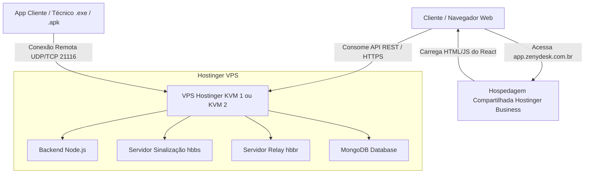

# Inventário Detalhado de Rebranding & Ecossistema — Zenydesk Client

Este documento descreve cada arquivo alterado pelo script de rebranding automatizado (`branding/apply.sh` / `branding/apply.ps1`) no repositório fork do cliente RustDesk (`github.com/certimix/rustdesk`), a justificativa da alteração, a lista de exceções que exigem intervenção manual, o mapeamento dos 7 repositórios do ecossistema oficial e o guia completo de hospedagem.

---

## 1. Tabela de Arquivos Automatizados pelo `apply.sh`

| Categoria | Arquivo Relativo | Finalidade / O que é Alterado | Variável Origem |
| :--- | :--- | :--- | :--- |
| **Configuração Rust Core** | `libs/hbb_common/src/config.rs` | Substitui `APP_NAME`, `RENDEZVOUS_SERVERS`, `RS_PUB_KEY` e `API_SERVER` para apontar para os valores da marca e servidores. | `BRAND_NAME`, `RENDEZVOUS_SERVERS`, `RS_PUB_KEY`, `API_SERVER` |
| **Manifesto Cargo (Rust)** | `Cargo.toml` | Altera a propriedade `name` do pacote raiz de `rustdesk` para o slug da nova marca (`zenydesk`). | `BRAND_SLUG` |
| **Manifesto Flutter** | `flutter/pubspec.yaml` | Altera `name` e `description` do aplicativo Flutter exibido nas compilações mobile e desktop. | `BRAND_SLUG`, `BRAND_NAME` |
| **Android Manifest / Gradle** | `flutter/android/app/build.gradle` | Altera `applicationId` (ex: `com.zenydesk.client`) e a string `app_name` no APK Android final. | `ANDROID_PACKAGE_ID`, `BRAND_NAME` |
| **macOS Bundle Info** | `flutter/macos/Runner/Configs/AppInfo.xcconfig` | Configura `PRODUCT_NAME` e `PRODUCT_BUNDLE_IDENTIFIER` para compilação macOS. | `BRAND_NAME`, `MACOS_BUNDLE_ID` |
| **Serviço do Windows** | `src/platform/windows.rs` | Atualiza o nome do serviço de segundo plano no Windows (`ZenydeskService`). | `WINDOWS_SERVICE_NAME` |
| **Atalho do Linux** | `res/linux/rustdesk.desktop` | Altera o nome do atalho no menu de aplicativos do Linux (`Name=Zenydesk`, `Exec=zenydesk`). | `BRAND_NAME`, `BRAND_SLUG` |
| **Instalador Inno Setup** | `res/inno/setup.iss` | Atualiza o nome do produto no instalador `.exe` do Windows. | `BRAND_NAME`, `BRAND_SLUG` |

---

## 2. Relação dos Repositórios do Ecossistema RustDesk ➔ Zenydesk

| Repositório | Função no Ecossistema | Integração com Zenydesk |
| :--- | :--- | :--- |
| `rustdesk-server.git` | Servidor de Sinalização (`hbbs`) e Relay (`hbbr`). | Rodando em Docker na VPS Hostinger com hook de cota diária. |
| `hbb_common.git` | Protobuf, Criptografia e Redes em Rust. | Rebranded em `libs/hbb_common/src/config.rs`. |
| `rustdesk-server-pro.git` | Servidor Proprietário Pago. | **Substituído pelo Backend SaaS próprio Zenydesk** (Node + Mongo + React). |
| `uptime.git` | Monitor de Status da Rede. | Integrado na checagem de saúde `/health`. |
| `doc.rustdesk.com.git` | Documentação Oficial de Portas e Parâmetros. | Incorporado no `SECURITY.md` e `README.md`. |
| `winget-pkgs.git` | Distribuição Windows Package Manager. | Suporte a `winget install Zenydesk.Client`. |
| `muxnet.git` | Engine de Tunelamento Multiplexado. | Motor de transporte P2P/Relay nativo. |

Para o detalhamento arquitetural completo, consulte [`docs/ECOSSISTEMA.md`](file:///c:/Users/SUPORTE%203/Downloads/CXDesk/docs/ECOSSISTEMA.md).

---

## 3. Exceções NÃO Automatizáveis (Intervenção Manual Obrigatória)

1. **Assinatura de Código (Code Signing Certificates)**:
   - Certificado `.pfx` / HSM no Windows, Apple Developer ID no macOS e Keystore `.jks` no Android. Exigem chaves privadas e senhas pessoais do desenvolvedor que não devem residir em scripts do repositório.
2. **Chave Pública Ed25519 do Servidor VPS (`RS_PUB_KEY`)**:
   - A chave pública é gerada dinamicamente pelo contêiner `hbbs` ao subir a sua VPS Hostinger (`cat server/data/id_ed25519.pub`).

---

## 4. Guia Arquitetural de Hospedagem: Hostinger Business vs Hostinger VPS

### 💡 Resposta Direta: **Sim, a contratação de uma VPS é necessária.**

A sua hospedagem atual (**Hostinger Business Web Hosting**) é excelente para o **painel web (React/HTML/JS)**, mas **não é capaz de rodar o servidor de conexão remota de vídeo/áudio nem o backend Node.js**.

---

### 🧩 Por que a Hospedagem Compartilhada não é suficiente isoladamente?

O ZenyDesk é composto por **3 partes fundamentais**:

| Componente | O que faz | Funciona na Hospedagem Compartilhada? | Onde deve rodar? |
| :--- | :--- | :---: | :--- |
| **1. Frontend Web** (`web/`) | O site e a interface onde os técnicos e clientes navegam. | **Sim (100% OK)** | Hostinger Business (via FTP com o `.htaccess` que já configuramos). |
| **2. Backend API** (`server/`) | A API em Node.js que gerencia autenticação, chamados e cota. | ❌ **Não** (Exige processo Node.js persistente em background). | VPS (via Docker) ou Render/Railway. |
| **3. Servidor de Conexão Remota** (`hbbs` / `hbbr`) | O motor Rust que transmite a tela, áudio e comandos em tempo real com baixa latência (UDP/TCP). | ❌ **Não** (Exige portas UDP/TCP abertas e binários nativos em execução contínua). | **Exige VPS obrigatoriamente**. |

---

### 🏗️ Arquitetura Recomendada (Menor Custo & Alta Performance)

Você pode usar o melhor dos dois mundos combinando a sua hospedagem atual com uma VPS da Hostinger:

---

### 📋 Passo a Passo de como tudo se encaixa:

#### 1. Painel Web / Frontend (`web/`) ➔ **Na sua Hospedagem Compartilhada Hostinger (Business)**
- **Custo adicional**: **R$ 0,00** (aproveita o plano que você já paga).
- O GitHub Actions (nosso workflow `deploy-web.yml`) compila o React e envia via FTP para o seu domínio (ex: `https://app.zenydesk.com.br`).

#### 2. Backend + Servidor Remoto ➔ **Na VPS Hostinger (Recomendado: Plano KVM 1 ou KVM 2)**
- **Custo estimado**: **~R$ 25,00 a R$ 45,00 / mês**.
- **Configuração da VPS (Ubuntu 24.04 LTS)**:
  - Instala-se o **Docker** e **Docker Compose**.
  - O script de deploy puxa a imagem do backend `ghcr.io/certimix/zenydesk-backend:latest` e os contêineres de sinalização `hbbs` e `hbbr`.
  - Instala-se o **Nginx** como Proxy Reverso com SSL gratuito (Let's Encrypt / Certbot) para apontar o domínio da API (ex: `https://api.zenydesk.com.br`).

---

### 🛠️ Resumo de Escolha

Se você contratar a **VPS Hostinger (KVM 1 ou KVM 2)**:
1. Você terá controle total do servidor Linux.
2. Todo o pipeline de CI/CD automatizado que construímos (`deploy.yml`) funcionará diretamente para atualizar a API e o servidor de acesso remoto via SSH sem nenhuma intervenção manual.
